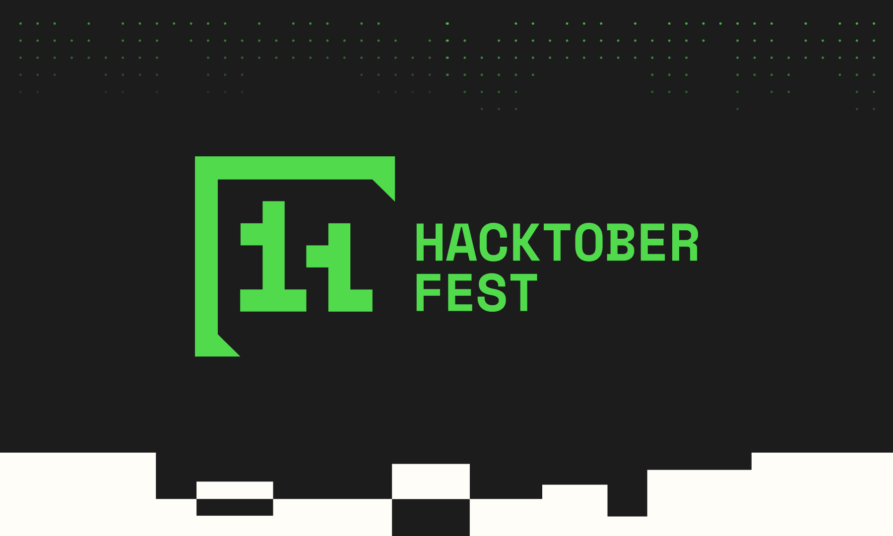

# Hacktoberfest 2024 🎉👩‍💻👨
# 👋 Welcome to Hacktoberfest 2024!

We're excited to have you here. Dive into the world of open source, contribute to meaningful projects, and connect with developers worldwide. Whether it's your first PR or your hundredth, every contribution counts. Let's build something great together!



[](https://github.com/hackelite01/hacktoberfest2024)
[](https://github.com/hackelite01/hacktoberfest2024)

---

## 📣 Join Us for Hacktoberfest 2024! 🍂

Hacktoberfest is all about celebrating open source, giving back to the community, and growing your coding skills.

**📅 Event Date**: October 1st - October 31st, 2024

### 🔥 How to Participate?

1. **Sign up for Hacktoberfest**: Head over to the [Official Hacktoberfest website](https://hacktoberfest.com/) and register with your GitHub account before the 30th of October.
2. **Start Contributing**: You’re free to contribute any quality code as long as it works! We have already created proper directories for different languages like `Java`, `Kotlin`, `JavaScript`, `React Native`, `Python`, and more. If you want to add a project in a different language like `Go`, `C#`, etc., feel free to create a separate directory. Just make sure to keep things organized. 👍  <strong>To contribute to existing open-source projects, visit the [Project List](/Project%20List/ProjectList.md) folder to contribute existing opensource project.</strong>

---
## What Can You Contribute? 🛠️

We’re looking for contributions in the following areas:

- **Beginner Projects**: Share your small applications like a calculator, quiz, or to-do list app.
- **New Projects**: Feel free to add new projects to any existing directories, or if it’s in a new language, create a separate directory.
- **Documentation**: Add or update documentation files.
- **Bug Fixes**: Spot and fix any bugs in the existing projects.
- **Refactoring**: Improve the structure of existing code to make it cleaner.
- **Style Improvements**: Enhance the UI or code styling.
- **Low or Non-Code Contributions**: You can also contribute by improving documentation, creating tutorials, designing graphics, or any other non-code contributions. For more details, visit the [Hacktoberfest Low or Non-Code Contributions](https://hacktoberfest.com/participation/#low-or-non-code) page.
- **Your Creativity**: Use your creativity to brainstorm new features or improvements for existing projects. Your unique ideas can make a significant impact!

**To contribute to existing open-source projects, visit the [Project List](/Project%20List/ProjectList.md) folder to contribute to existing open-source projects.**


**Note**: For more information, you can visit [Hacktoberfest Website](https://hacktoberfest.com/participation/)!

---

## Quick Start Guide 🚀
Now, you're ready to start contributing. Follow these simple steps, and you'll be contributing in no time:

1. **Fork this Repository**: By clicking the "[Fork](https://github.com/hackelite01/hacktoberfest2024/fork)" button at the top-right, you create your personal copy of this repository, your canvas for collaboration. You can use GitHub Desktop or Git CLI to make this process even easier.
2. **Clone it on Your Local Machine**: Use the following command to clone the repository.

    ```terminal
    git clone https://github.com/hackelite01/hacktoberfest2024.git
    ```

3. **Navigate to the Project Directory**: Move into the project directory.

    ```terminal
    cd hacktoberfest2024
    ```

4. **Create a New Branch**: With your fork ready, craft a new branch for your work. You can do this via the GitHub Desktop app or using Git commands in your terminal.

    ```terminal
    git checkout -b my-new-branch
    ```

5. **Make Your Changes**: Now, your creativity knows no bounds. Whether it's an innovative project, a problem solution, or a cool creation, share it with us. Contribute to your chosen language's folder by adding your code, projects, or solutions.

6. **Commit Your Changes**: As you work on your project, ensure you commit your changes regularly to your new branch.

    ```terminal
    git commit -m "Relevant message"
    ```

7. **Push to GitHub**: Once your masterpiece is ready, push your branch to your GitHub fork.

    ```terminal
    git push origin my-new-branch
    ```

8. **Create a Pull Request (PR)**: The finishing touch! Submit a Pull Request from your fork to this repository. Our team is eager to review it, and if it's a valid program without errors, it'll become part of the community.

If you need detailed instructions and a step-by-step guide on making your first open-source contribution, check out [this article](https://zeeshanmukhtar1.hashnode.dev/your-first-open-source-contribution). It covers everything from forking the repository to making your first pull request in the Real Full Stack Project. Happy coding! 💻

---


## Avoid Conflicts {Syncing your fork}

An easy way to avoid conflicts is to add an 'upstream' for your git repo, as other PRs may be merged while you're working on your branch/fork.

```terminal
git remote add upstream https://github.com/hackelite01/hacktoberfest2024
```

You can verify that the new remote has been added by typing:

```terminal
git remote -v
```

To pull any new changes from your parent repo, simply run:

```terminal
git merge upstream/master
```

This will give you any eventual conflicts and allow you to easily solve them in your repo. It's a good idea to use it frequently in between your own commits to make sure that your repo is up to date with its parent.

For more information on syncing forks, [read this article from GitHub](https://help.github.com/articles/syncing-a-fork/).

---


## 🚀 Contribution Guidelines

We welcome contributions from everyone! Please review our [Contribution Guidelines](CONTRIBUTION_GUIDELINES.md) to get started.

For behavior expectations and community standards, refer to our [Code of Conduct](CODE_OF_CONDUCT.md).

---

## Contributors 💖

Thanks to all the amazing contributors who have helped make a thriving community! 🌟

<a href="https://github.com/hackelite01/hacktoberfest2024/graphs/contributors">
    
</a>

---

**Excited to dive into Hacktoberfest 2024?** Fork the repository, follow the guidelines, and start contributing. We can't wait to see what you build! 💻✨
